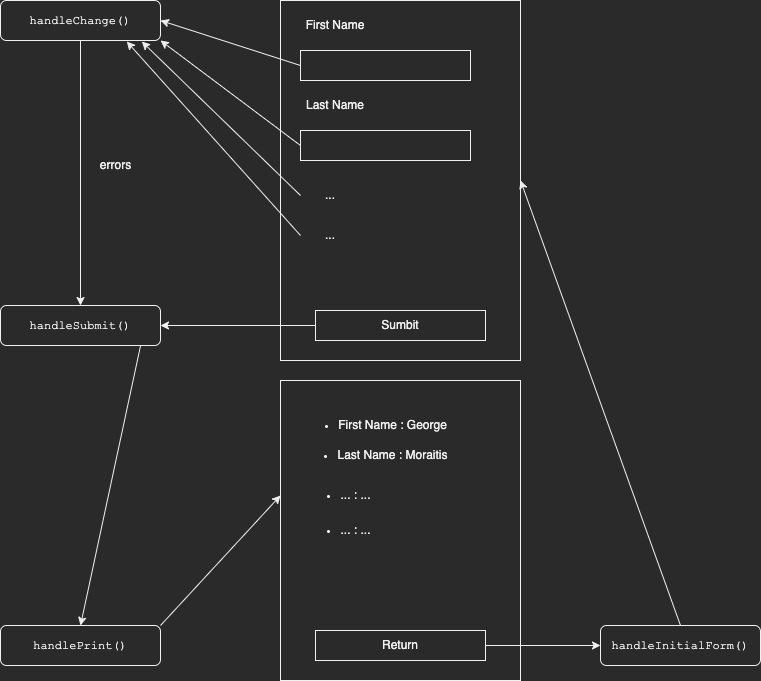

# Exercise

### Technical Assignment - Create a booking form 

### Context 
You are running a laser tag company and would like to create a form for people to book a session. 

### Task 
Create a small purely frontend web application. You can use any language/framework you want for this task but ReactJS is preferred. 

The application should consist of a simple form with the following fields: 

- Firstname

- Lastname

- Email address

- Number of people in the booking 

- Date desired for the laser tag session 

- Time desired for the laser tag session 
	- 1h sessions 
	- Open from 8AM to 7PM 

### Additional comments 

There should be a Submit button to validate the form. 
Clicking the Submit button should print the content of the form somewhere on the page  (no email sending, storing in database, or anything like that. Just print the information somewhere). 


### Acceptance criteria 
- The app code is accessible and can be imported easily. 
- A Readme file is provided to explain how to run the app. 
	- If the app is hosted somewhere online, a link to - access it should be provided 
	- If the app needs to be run locally, the steps to run it are provided 

### Assessed criteria 
- Design and layout
- Code readability
- Ability to fulfil acceptance criteria 
- Clarity of explanations in readme file
- Initiatives taken 

</br>

# Getting Started

This project was bootstrapped with [Create React App](https://github.com/facebook/create-react-app).

### Node version

```bash
18.7.0
```


### Available Scripts

In the project directory, you can run:

```bash
# Installing the project to run locally
npm install


# Runs the app in the development mode.Open [http://localhost:3000](http://localhost:3000) to view it in your browser.The page will reload when you make changes.You may also see any lint errors in the console.
npm start

# Deploy the React app to GitHub Pages
npm run deploy -- -m "Deploy React app to GitHub Pages"
```

## The tutorial
### The pattern of the app.
1. Write the data.
2. Click on submit button to submit the data.
3. The app shows you the submitted data in a list.
4. Click on the return button to return to the initial form.

### What is happening inside the code?
<br>

 

When we write something on each placeholder, we keep firing up the `handleChange()` function, which validates each data. Then we have the `state` with the `errors` and `data`.

When we click the submit button, we fire up the `handleSubmit()` function, which will print in the console if the form is eventually valid or not. It using the `validateForm()` function passing inside the errors from the `handleChange()` function.

The `handleSubmit()` function also will call the `handlePrint()` function that will change the flag `submitting` to `true`. This flag is in the `defaultState` with initially the value  as`true`.

Next, after the `submiiting` becomes `true` renders the list. Below the list is a return button that will bring us back to the original form using the `handleInitialForm()` function. 


### Link of the application running on Github Pages
https://gmoraitis.github.io/lazer_tag_form/


